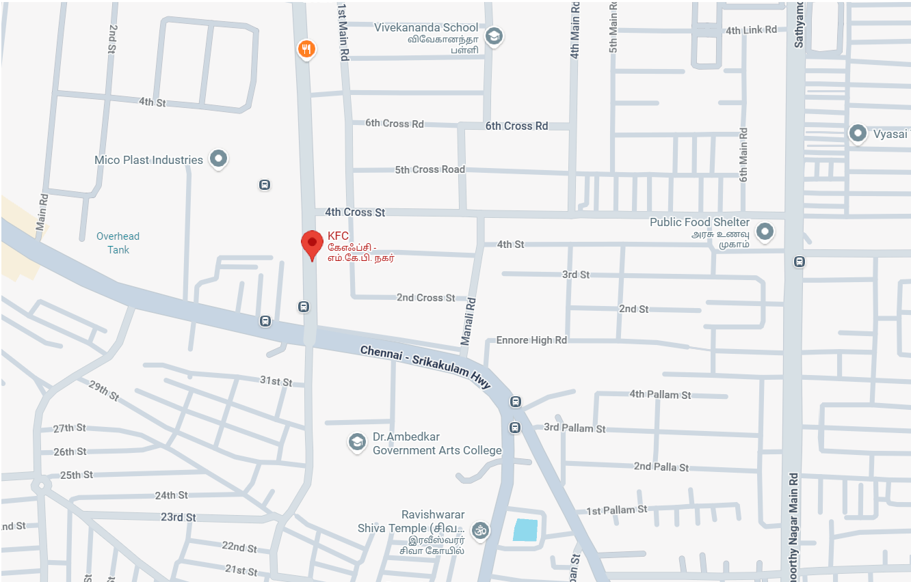

# Ex04 Places Around Me
## Date: 11-12-2025

## AIM
To develop a website to display details about the places around my house.

## DESIGN STEPS

### STEP 1
Create a Django admin interface.

### STEP 2
Download your city map from Google.

### STEP 3
Using ```<map>``` tag name the map.

### STEP 4
Create clickable regions in the image using ```<area>``` tag.

### STEP 5
Write HTML programs for all the regions identified.

### STEP 6
Execute the programs and publish them.

## CODE
```
<!DOCTYPE html>
<html lang="en">
<head>
  <meta charset="UTF-8">
  <meta name="viewport" content="width=device-width, initial-scale=1.0">
  <title>Document</title>
</head>
<body>
<!-- Image Map Generated by http://www.image-map.net/ -->


<map name="image-map">
    <area target="_blank" alt="KFC" title="KFC" href="kfc.html" coords="454,376,446,369,444,362,447,354,455,349,460,350,466,353,468,361,467,367,463,372,454,359,459,366" shape="poly">
    <area target="_blank" alt="Vivekananda Vidyalaya" title="Vivekananda Vidyalaya" href="school.html" coords="721,65,715,59,712,51,715,43,721,41,728,41,731,49,732,54,729,60" shape="poly">
    <area target="_blank" alt="Lord Shiva Temple" title="Lord Shiva Temple" href="temple.html" coords="699,790,690,781,689,768,696,761,706,762,712,765,713,773,712,778,709,784" shape="poly">
    <area target="_blank" alt="Dr.Ambedkar college" title="Dr.Ambedkar college" href="college.html" coords="519,630,525,627,529,632,534,637,534,644,530,650,523,653,515,650,510,638" shape="poly">
    <area target="_blank" alt="DOMINOS" title="DOMINOS" href="dominos.html" coords="445,82,453,79,457,69,451,60,441,55,435,62,433,70,433,77" shape="poly">
</map>
</body>
</html>

<!DOCTYPE html>
<html lang="en">
<head>
  <meta charset="UTF-8">
  <meta name="viewport" content="width=device-width, initial-scale=1.0">
  <title>Document</title>
</head>
<body background="https://wallpaperaccess.com/full/1611293.jpg">
  <H1 align="center"> KFC</H1>
  <p align="center"> KFC is a global fast-food powerhouse built on Colonel Sanders’ <br>
    secret recipe, now operating nearly 32,000 restaurants worldwide under Yum! Brands,<br>
     with strong commitments to community and sustainability.</p>
     <p align="center">🍗 Products<br>>

Chicken burgers, wraps, and sandwiches<br>

French fries, salads, desserts, milkshakes, and breakfasts</p>

</body>
</html>

<!DOCTYPE html>
<html lang="en">
<head>
    <meta charset="UTF-8">
    <meta name="viewport" content="width=device-width, initial-scale=1.0">
    <title>Document</title>
    <style>
        body{
                background: url("https://png.pngtree.com/background/20230613/original/pngtree-the-architecture-of-your-school-building-the-architect-of-the-building-picture-image_3409970.jpg")no-repeat;
                background-size: cover;
        }
    </style>
</head>
<body background="https://png.pngtree.com/background/20230613/original/pngtree-the-architecture-of-your-school-building-the-architect-of-the-building-picture-image_3409970.jpg"
    <h1 align ="center"><b>Vivekananda Vidyalaya sr school</b></h1>
    <p align ="center">Vivekananda Schools in India are known for their emphasis on holistic education,<br>
         values-based learning, and progressive teaching methods.<br>
          They combine academic excellence with character development, <br>
          inspired by the philosophy of Swami Vivekananda.</p>
</body>
</html>

<!DOCTYPE html>
<html lang="en">
<head>
    <meta charset="UTF-8">
    <meta name="viewport" content="width=device-width, initial-scale=1.0">
    <title>Document</title>
    <style>
        body{
                background: url("https://tse2.mm.bing.net/th/id/OIP.bfZ0TFi4YMFF3VbwVABGbgHaEK?cb=ucfimg2&ucfimg=1&rs=1&pid=ImgDetMain&o=7&rm=3")no-repeat;
                background-size: cover;
        }
    </style
</head>
<body>
    <h1 align="center"> Ravishwarar Shiva Temple</h1>
    <p align="center" style="font-family: fantasy;">
        Ravishwarar Shiva Temple is an ancient Chola-period temple located in Vyasarpadi,<br>
         Chennai, dedicated to Lord Shiva in the form of Ravishwarar (associated with Surya, the Sun).
         <br> It is one of the oldest temples in the region and remains a vibrant spiritual center today
     </p>
     >

</body>
</html>

<!DOCTYPE html>
<html lang="en">
<head>
    <meta charset="UTF-8">
    <meta name="viewport" content="width=device-width, initial-scale=1.0">
    <title>Document</title>
    <style>
        body{
                background: url("https://tse3.mm.bing.net/th/id/OIP.M0luJDZwqcE71ftbf31ajgHaE8?cb=ucfimg2&ucfimg=1&rs=1&pid=ImgDetMain&o=7&rm=3")no-repeat;
                background-size: cover;
        }
    </style>
</head>
<body> 
    <h1 align="center">Dr.Ambedkar arts Government college</h1>
    <p align="center"> Dr. Ambedkar Government Arts College (DAGAC), Vyasarpadi, Chennai, is a public institution established in 1972,<br>
         affiliated with the University of Madras, and re-accredited with a NAAC ‘B’ grade.<br>
          It offers undergraduate, postgraduate, and research programs across arts, science, and commerce disciplines.</p>
</body>
</html>

<!DOCTYPE html>
<html lang="en">
<head>
    <meta charset="UTF-8">
    <meta name="viewport" content="width=device-width, initial-scale=1.0">
    <title>Document</title>
    <style>
        body{
            background:url("https://visitpeachtreecity.com/imager/files_idss_com/C499/99fc50c3-f672-41c9-bbcb-b41928f15c6f_e45adf5f6bc0c5c2a30a39868f44eab6.jpeg") no-repeat;
            background-size: cover;
        }
    </style>
</head>
<body>
    <h1 align="center"><B>DOMINOS</B></h1>
    <p  align="center">Domino’s Pizza is a global fast‑food chain known for its freshly baked pizzas,<br>
        quick delivery, and affordable meals.<br>
                🍴 Menu Highlights<br>
Classic Pizzas: Margherita, Farmhouse, Peppy Paneer, Chicken Dominator.<br>
Sides: Garlic breadsticks, pasta, chicken wings, tacos, and desserts like choco lava cake.<br>
Customization: Choice of crusts (cheese burst, wheat thin crust, classic hand-tossed) and toppings.</p>
</body>
</html>
```

## OUTPUT



## RESULT
The program for implementing image maps using HTML is executed successfully.
